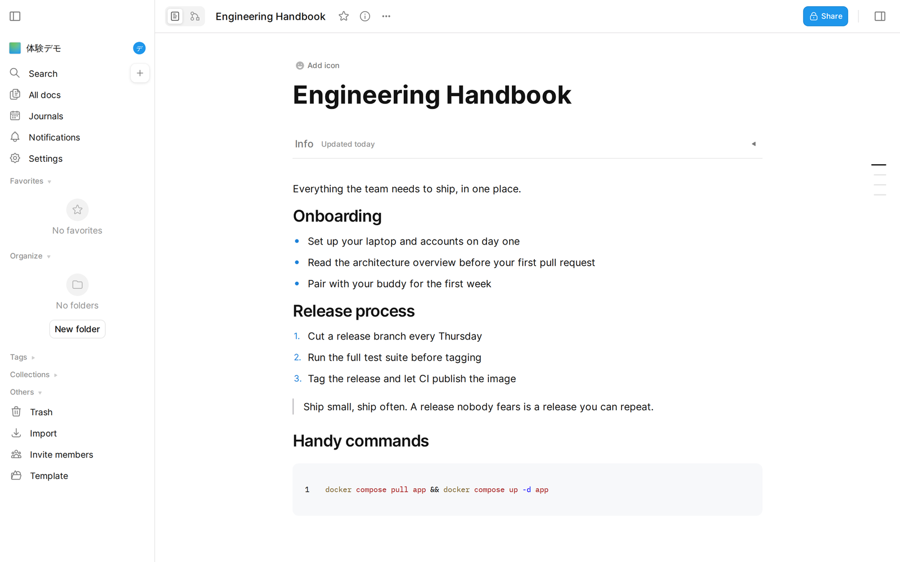
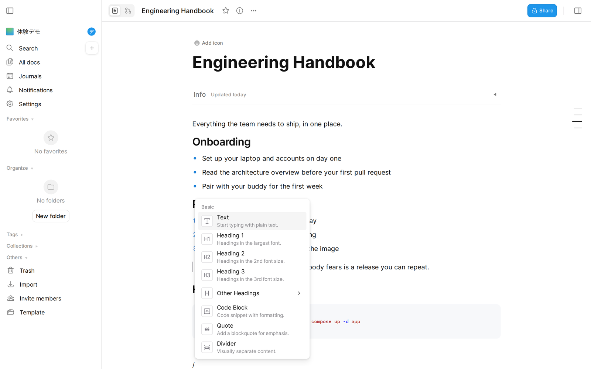

# ofuro-wiki

<p align="center">
  
</p>

<p align="center">
  <b>セルフホスト型の Notion オルタナティブ。外部送信ゼロ設計、MIT ライセンス。</b><br>
  アイデアが湧き出てくる、セキュアな社内 Wiki プラットフォーム。<br>
  お風呂（ofuro）のように、自然とアイデアが出てくる場所をイメージして。
</p>

<p align="center">
  <a href="LICENSE"></a>
  <a href="https://github.com/ulysseus-inc/ofuro-wiki/releases"></a>
  <a href="https://github.com/ulysseus-inc/ofuro-wiki/pkgs/container/ofuro-wiki"></a>
</p>

<p align="center">
  <b>日本語</b> | <a href="README.en.md">English</a>
</p>

<p align="center">
  
  
</p>

---

## ライブデモ

インストール不要で、すぐに触れます。

**▶ [https://ofuro-wiki-demo.ulysseus.co.jp](https://ofuro-wiki-demo.ulysseus.co.jp)**

| ログイン | |
|---|---|
| メールアドレス | `demo@demo.com` |
| パスワード | `demodemo` |

> 共用のデモ環境です。毎晩 3:00（JST）に初期状態へリセットされます。
> 機密情報は入力しないでください。

---

## 特徴

- **Notion ライクなブロックエディタ** — BlockSuite による `/` コマンド・ドラッグ&ドロップ
- **リアルタイム同期** — Yjs + Socket.IO による複数人同時編集
- **全文検索** — PGroonga による日本語対応の高速検索
- **シングルサインオン（SSO）** — OIDC 対応。Google・Keycloak 等のアカウントでサインイン（[設定手順](docs/sso-setup.md)）
- **セルフホスト完結** — Docker 1コマンドで起動、外部サービス依存なし
- **プライバシー重視** — テレメトリ・外部送信を完全無効化

## 技術スタック

| 区分 | 技術 |
|------|------|
| フロントエンド | AFFiNE (MIT) + BlockSuite (MPL-2.0) |
| バックエンド | NestJS + GraphQL + Socket.IO（※独自開発） |
| データベース | PostgreSQL + PGroonga（全文検索） |
| 認証 | JWT |
| インフラ | Docker / Docker Compose |

> ※ AFFiNE のバックエンドは商用ライセンス（EE）のため、ofuro-wiki では
> バックエンドを独自開発しています。これにより全体を MIT ライセンスで提供できます。

## クイックスタート

必要なのは **Docker だけ**です。ビルド済みの公開イメージを使うため、
リポジトリの clone もビルドも不要です（**RAM 1GB + Swap 2GB の GCE e2-micro
（無料枠）で稼働実績あり**）。

### 1. ファイルの取得

```bash
mkdir ofuro-wiki && cd ofuro-wiki
curl -O https://raw.githubusercontent.com/ulysseus-inc/ofuro-wiki/main/docker-compose.yml
curl --create-dirs -o backend/.env.example https://raw.githubusercontent.com/ulysseus-inc/ofuro-wiki/main/backend/.env.example
```

### 2. 環境変数の設定

```bash
cp backend/.env.example .env
```

`.env` を開き、最低限以下を設定してください：

```bash
JWT_SECRET=<openssl rand -base64 48 で生成>
POSTGRES_PASSWORD=<openssl rand -base64 24 で生成>
BASE_URL=https://wiki.example.com
ADMIN_EMAIL=admin@example.com
```

さらに、使用するビルド済みイメージを追記します：

```bash
APP_IMAGE=ghcr.io/ulysseus-inc/ofuro-wiki:latest
POSTGRES_IMAGE=ghcr.io/ulysseus-inc/ofuro-wiki-postgres:latest
```

### 3. 起動

```bash
docker compose pull app postgres
docker compose up -d --no-build
```

> DB スキーマは初回起動時に自動構築されます（手動マイグレーション不要）。

> **ソースからビルドしたい場合**: リポジトリを clone して `docker compose build`
> （RAM 4GB 以上推奨）。詳細は [デプロイガイド](docs/deploy/README.md) を参照。

### 4. 確認

```bash
curl http://localhost:3010/api/health
```

ブラウザで `BASE_URL`（ローカルなら `http://localhost:3010`）にアクセスし、
`ADMIN_EMAIL` のアドレスでサインアップすれば完了です。

## ロール体系

| ロール | 権限 |
|--------|------|
| **Admin** | サーバー設定・全ユーザー管理 |
| **Owner** | ワークスペース内ユーザー管理・メンバー招待・各種設定 |
| **Member** | ドキュメントの読み書き |
| **Reader** | 読み取り専用 |

Admin は環境変数 `ADMIN_EMAIL` で指定したアドレスで初回サインアップすると付与されます。

## デプロイ

本番デプロイの詳細手順（Nginx / Caddy の設定、Swap、バックアップ等）は
[docs/deploy/README.md](docs/deploy/README.md) を参照してください。

### HTTP と HTTPS でのクリップボード動作の違い

ブラウザのセキュリティ仕様により、`navigator.clipboard` API は **HTTPS（またはlocalhost）でのみ** 利用可能です。
ofuro-wiki は HTTP 環境でもクリップボードが使えるよう対応していますが、動作に差があります。

| 操作 | HTTPS / localhost | HTTP（IPアドレス等） |
|------|:-----------------:|:--------------------:|
| エディタ内コピー＆ペースト | ✅ フル機能 | ✅ 動作する |
| 他アプリ（テキストエディタ等）へのペースト | ✅ フル機能 | ✅ プレーンテキストとして動作 |
| 他アプリからエディタへのペースト | ✅ フル機能 | ✅ 動作する |
| 別タブ・別ウィンドウ間のコピー＆ペースト | ✅ フル機能 | ❌ 動作しない |

> **本番・社内運用では HTTPS を強く推奨します。**
> HTTP のみで運用する場合は [パターン C](docs/deploy/pattern-C.md) を参照してください。

## セキュリティとプライバシー

ofuro-wiki は**外部への一切のデータ送信を行いません**。社内の機密情報を安心して管理できるよう、テレメトリ・トラッキングを設計レベルで完全に排除しています。

| 対策 | 内容 |
|------|------|
| **テレメトリ完全排除** | 上流の AFFiNE に含まれる Mixpanel・Sentry 等のテレメトリコードをすべて no-op スタブに置換。トラッキング関数は呼び出しても何も実行されません |
| **外部エンドポイントなし** | テレメトリ送信先 URL・API キー・DSN 等の設定値を一切保持しません |
| **Sentry 無効化** | エラー報告の外部送信を完全に無効化。`sentry.init()` は呼び出されません |
| **localStorage 汚染なし** | テレメトリ用のクライアント ID・セッション ID 等をブラウザに保存しません |
| **エアギャップ対応** | インターネット接続なしの完全閉域環境でも動作します |

> フォーク元の AFFiNE フロントエンドには 100 以上のファイルにトラッキング呼び出しが残っていますが、すべて no-op（何もしない関数）に差し替え済みです。コードパス上でイベント送信は一切発生しません。あわせて、コードプレビューの外部サンドボックス（affine.run）・外部 Web フォント（cdn.affine.pro / Google Fonts）といった**アプリ起因の外部読み込みも削除**しています。

> **補足（ユーザー操作起因の外部読み込みについて）**: 上記の「外部送信ゼロ」は、ユーザーが意図せず発生するテレメトリ・phone-home を設計レベルで排除することを指します。ユーザー自身が文書に外部コンテンツ（YouTube 動画の埋め込み・外部画像 URL 等）を挿入した場合、その表示時には当該コンテンツが提供元から読み込まれます。完全閉域での運用を徹底する場合は、リバースプロキシや CSP（`connect-src`/`frame-src` 等）で外部宛先を制限してください。

### リンクプレビュー・リッチ埋め込み（既定 OFF）

ブックマークや埋め込みブロック（YouTube・GitHub・Figma・Loom 等）のリッチ表示（タイトル・サムネイル・説明）には、対象 URL の OGP メタデータ取得が必要です。ofuro-wiki は上流 AFFiNE の**外部 Worker を使わず自サーバー内**（`/api/worker/link-preview`・`/api/worker/image-proxy`）で完結させています。

- **既定は OFF**（no-op）で、サーバーから外部への接続は発生しません（**外部送信ゼロを維持**）。この場合、埋め込みの iframe 再生などは動きますが、リッチなプレビューカードは表示されません。
- **管理者（Admin ロール）が管理画面 →「サーバー設定」→「リンクプレビュー・リッチ埋め込み」を ON** にすると、ユーザーが貼り付けた URL について**サーバーがその外部サイトへ接続**してメタデータ・画像を取得します（＝ユーザー操作起因の外部送信）。Admin 以外のユーザーはこの設定を変更できません。SSRF 対策（内部アドレス遮断・リダイレクト再検証・サイズ/タイムアウト上限）を実装しています。
- 完全閉域運用を維持したい場合は **OFF のまま**にしてください。

## 開発

ローカルでの開発環境セットアップ（依存インストール・DB・マイグレーション・dev サーバ起動・E2E）は [docs/development.md](docs/development.md) を参照してください。

## コントリビューション

**バグ報告・機能提案は [Issue](../../issues) で歓迎します。**
ただし公開初期は運用安定のため、**外部からの Pull Request は現在受け付けていません**
（コード変更はメンテナのみ。方針は今後変更される場合があります）。

- 詳細・方針: [CONTRIBUTING.md](CONTRIBUTING.md)
- 行動規範: [CODE_OF_CONDUCT.md](CODE_OF_CONDUCT.md)
- セキュリティ脆弱性の報告（**公開 Issue にしないでください**）: [SECURITY.md](SECURITY.md)

## ライセンス

ofuro-wiki 本体: **MIT License** — 詳細は [LICENSE](LICENSE) を参照。

本プロジェクトは [AFFiNE](https://github.com/toeverything/AFFiNE)（フロントエンド: MIT）の派生で、エディタの [BlockSuite](https://github.com/toeverything/blocksuite) 由来ファイルは **MPL-2.0**（ファイル単位）です。その他、libvips（LGPL-3.0）等を含みます。

- 第三者依存のライセンス監査結果: [THIRD-PARTY-LICENSES.md](THIRD-PARTY-LICENSES.md)
- 各コンポーネントの帰属表示: [NOTICE](NOTICE)
